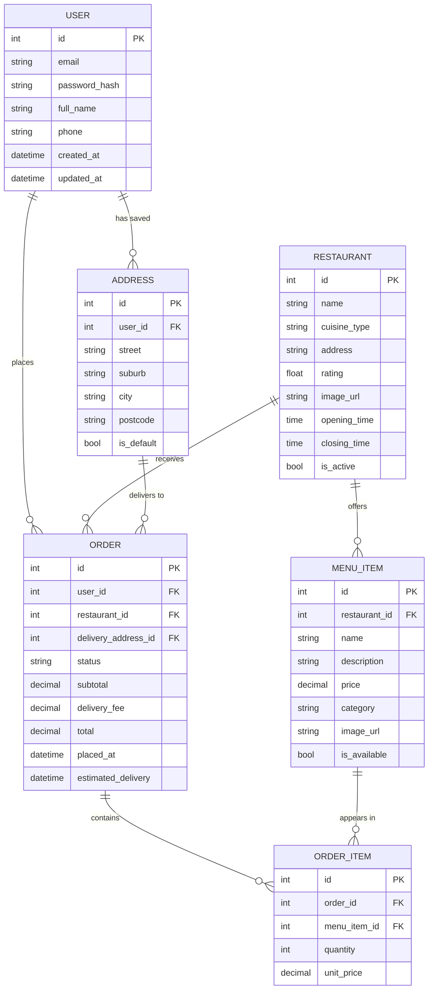

# Database Design
{: .no_toc }

This page documents the relational database schema used by FeedMe, including the entity-relationship model, table definitions, and key design decisions.

  
Table of contents

  {: .text-delta }
- TOC
{:toc}

---

## Overview

FeedMe uses a **relational database** to store all application data. The schema is designed around five core domain entities: **User**, **Restaurant**, **MenuItem**, **Order**, and **Address**.

| Environment | Database | Reason |
|---|---|---|
| Development | SQLite | Zero-configuration, file-based, ships with Python |
| Production | PostgreSQL (AWS RDS) | Managed, scalable, ACID-compliant |

---

## Entity-Relationship Diagram

---

## Table Descriptions

### USER
Stores registered customer accounts. Authentication is handled via Django's built-in `auth.User` model using email + hashed password. The `full_name` field is split into `first_name` / `last_name` at the Django ORM level.

| Field | Type | Notes |
|---|---|---|
| id | int | Auto-incrementing primary key |
| email | string | Unique — used as username for login |
| password_hash | string | bcrypt hash via Django's `set_password()` |
| full_name | string | Display name shown in UI |
| phone | string | Optional contact number |
| created_at | datetime | Account registration timestamp |
| updated_at | datetime | Last profile update timestamp |

---

### ADDRESS
Delivery addresses saved by a user. A user can save multiple addresses (e.g. home, work). Each order references exactly one delivery address.

| Field | Type | Notes |
|---|---|---|
| id | int | Primary key |
| user_id | int (FK) | References USER |
| street | string | Street number and name |
| suburb | string | Suburb or neighbourhood |
| city | string | City |
| postcode | string | Postal code |
| is_default | bool | Whether this is the user's default delivery address |

---

### RESTAURANT
Represents a food vendor available on the platform. Contains metadata used in the browse and search views.

| Field | Type | Notes |
|---|---|---|
| id | int | Primary key |
| name | string | Restaurant display name |
| cuisine_type | string | e.g. "Italian", "Japanese", "Burgers" |
| address | string | Physical restaurant address |
| rating | float | Aggregate star rating (0.0–5.0) |
| image_url | string | Hero image for browse cards |
| opening_time | time | Daily opening time |
| closing_time | time | Daily closing time |
| is_active | bool | Controls visibility without deleting records |

---

### MENU_ITEM
Individual dishes offered by a restaurant. Linked to a restaurant via `restaurant_id`.

| Field | Type | Notes |
|---|---|---|
| id | int | Primary key |
| restaurant_id | int (FK) | References RESTAURANT |
| name | string | Dish name |
| description | string | Short description |
| price | decimal | Current listed price |
| category | string | Menu section (e.g. "Starters", "Mains", "Drinks") |
| image_url | string | Dish photo |
| is_available | bool | Hides out-of-stock items without deleting them |

---

### ORDER
A confirmed order placed by a user. Tracks the full lifecycle from placement to delivery.

| Field | Type | Notes |
|---|---|---|
| id | int | Primary key |
| user_id | int (FK) | References USER |
| restaurant_id | int (FK) | References RESTAURANT |
| delivery_address_id | int (FK) | References ADDRESS |
| status | string | Enum: `pending` → `confirmed` → `preparing` → `on_the_way` → `delivered` |
| subtotal | decimal | Sum of all ORDER_ITEMs |
| delivery_fee | decimal | Fixed delivery charge |
| total | decimal | subtotal + delivery_fee |
| placed_at | datetime | When the order was submitted |
| estimated_delivery | datetime | Estimated arrival time |

---

### ORDER_ITEM
Line items within an order. Each row represents one menu item at a specific quantity.

| Field | Type | Notes |
|---|---|---|
| id | int | Primary key |
| order_id | int (FK) | References ORDER |
| menu_item_id | int (FK) | References MENU_ITEM |
| quantity | int | Number of units ordered |
| unit_price | decimal | **Price snapshot at time of order** (see design decisions below) |

---

## Key Design Decisions

| Decision | Choice | Reason |
|---|---|---|
| ORM | Django ORM | Reduces boilerplate, handles migrations, integrates with DRF |
| Dev database | SQLite | Zero-config local development, no server needed |
| Prod database | PostgreSQL (AWS RDS) | Scalable, managed, supports concurrent users |
| Price snapshot | `unit_price` in ORDER_ITEM | Historical orders stay accurate even when menu prices change later |
| Soft deletes via flags | `is_active`, `is_available` | Data is preserved; restaurants/items can be hidden without losing order history |
| Email as username | `User.username = email` | Simplifies authentication — users identify with email, not a separate username |
| Multiple addresses | Separate ADDRESS table | Supports US-09 (delivery location selection) — users can save home, work, etc. |
