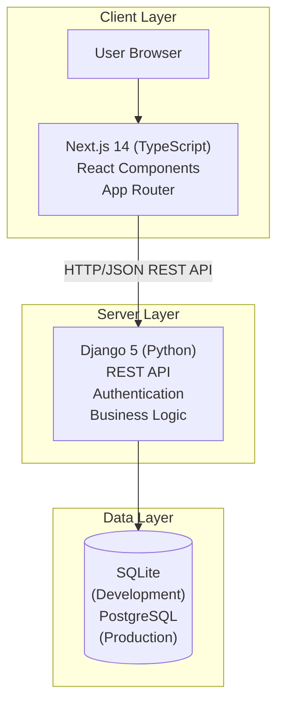
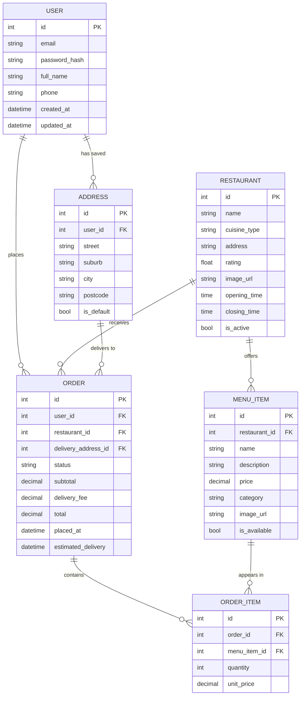
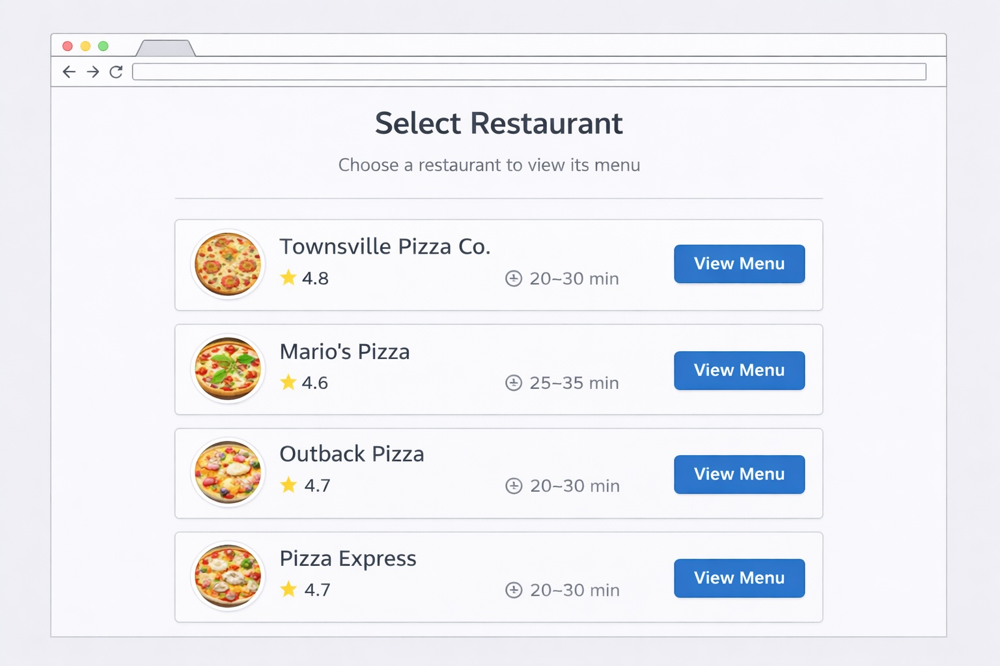
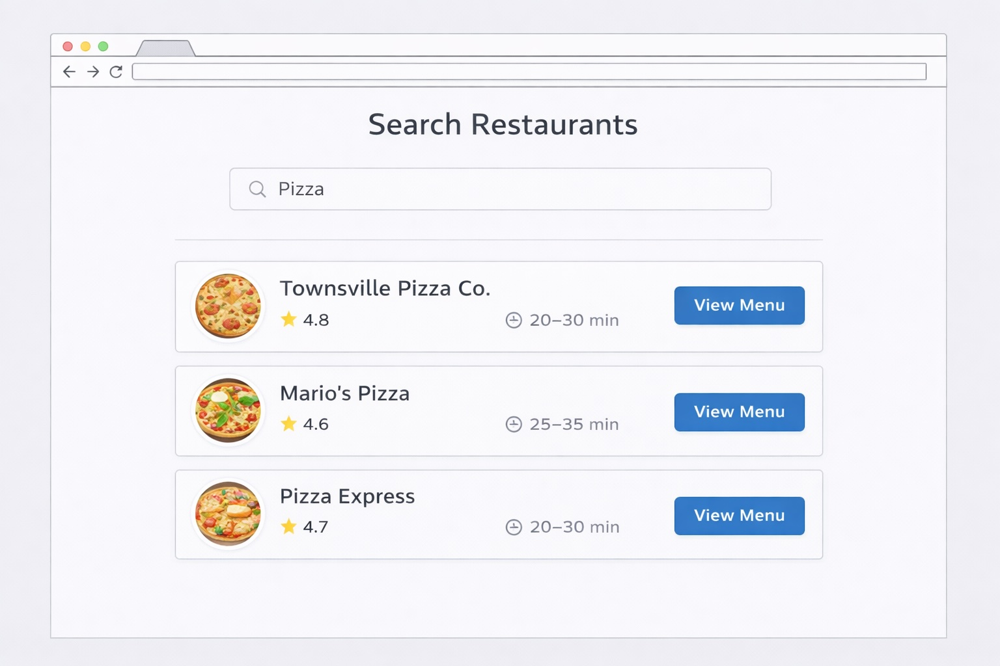
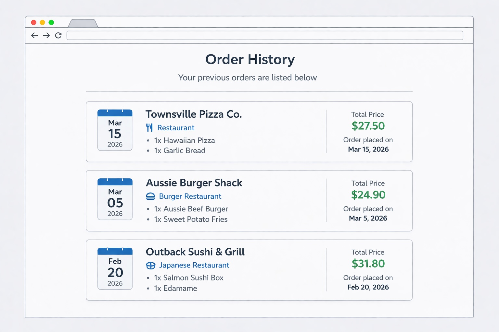
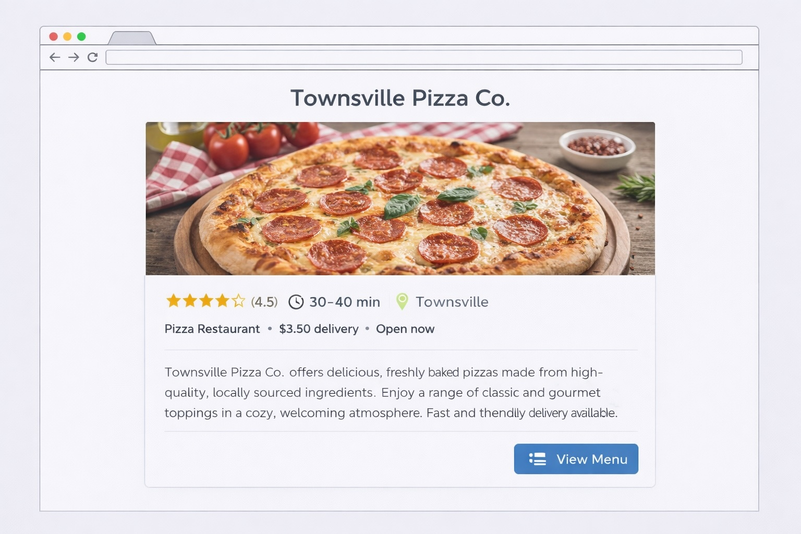

# Design
{: .no_toc }


This page documents the architectural, database, and user interface design decisions for FeedMe.

<details open markdown="block">
  <summary>Table of contents</summary>
  {: .text-delta }
- TOC
{:toc}
</details>

---

## System Architecture

FeedMe follows a **decoupled client–server architecture**. The frontend and backend are separate applications that communicate via a REST API. This separation allows each layer to be developed, tested, and deployed independently.



### Architectural Decisions

| Decision | Choice | Justification |
|----------|--------|---------------|
| Frontend framework | Next.js 14 (TypeScript) | Server-side rendering improves performance and SEO; App Router provides file-based routing |
| Backend framework | Django 5 (Python) | Mature ORM, built-in admin, rapid API development with Django REST Framework |
| API style | REST (JSON) | Simple, stateless, widely supported; suitable for a CRUD-heavy food delivery domain |
| Database (dev) | SQLite | Zero-configuration, file-based, ships with Python — ideal for development and testing |
| Database (prod) | PostgreSQL | Production-grade, ACID-compliant, fully supported by Django ORM |
| Authentication | JWT (JSON Web Tokens) | Stateless auth that works well with decoupled frontend/backend architecture |
| Styling | Tailwind CSS | Utility-first CSS, rapid UI development, consistent design system |

---

## Database Design

The database models reflect the core domain of a food delivery application: users place orders from restaurants, each order containing menu items.



### Key Design Decisions

- **`ORDER_ITEM.unit_price`** stores the price at the time of ordering, so historical orders remain accurate even if menu prices change later.
- **`ADDRESS`** is a separate table linked to users, supporting multiple saved addresses per account (US-08, US-09).
- **`RESTAURANT.is_active`** allows restaurants to be disabled without deleting their data or order history.
- **`ORDER.status`** uses a string enum (`pending`, `confirmed`, `preparing`, `on_the_way`, `delivered`, `cancelled`) to track delivery lifecycle (US-07).

---

## User Interface Design

The UI was designed before coding began, using wireframe mockups to align the team on expected behaviour and layout before implementation.

### Design Principles

1. **Mobile-first**: Most food delivery usage is on mobile — all layouts start from a narrow viewport and scale up.
2. **Minimal friction**: The primary user journey (browse → add → checkout) requires no more than 3 clicks.
3. **Visual consistency**: Red/black colour scheme applied throughout using a shared Tailwind config.
4. **Clear feedback**: Every user action (add to cart, confirm order) produces immediate visual feedback.

### Key Screens

#### Home / Browse Screen

The home screen is the entry point after login. It presents food categories as clickable cards, allowing users to jump directly into a cuisine type.

- Header: FeedMe logo, delivery address selector, cart icon with item count
- Body: Category grid — each card has a full-bleed food image and category label
- Bottom nav: Home, Search, Orders, Profile

#### Restaurant Menu Screen

After selecting a category and restaurant, the user sees the full menu grouped by section.

- Sticky header shows restaurant name, rating, and delivery time
- Menu items displayed as cards: image left, name + description + price right
- Floating "Add to Cart" button anchored to bottom of screen, showing running total

#### Shopping Cart Page

Before checkout, the user reviews their selection. The shopping cart is primarly client side in Next.js using React and localstorage, after data is fetched from the database. The items for the cart are stored locally and server is only called during checkout. The backend of the cart operates through the 'CartItem' interface:

```typescript
export type CartItem ={
      id: number;
  name: string;
  quantity: number;
  price: number;
}
```
Ideally, a whole production version of FeedMe would involve full connection to the database(linkes with the users account) at all times to get live changes but sticking with the hybrid localstorage and database system for single user mvp. 

- List of items with quantity stepper (+/−) and line prices
- Subtotal + delivery fee + tax + total shown at bottom
- "Confirm Order" CTA navigates to checkout

#### Checkout / Confirmation Screen

Final step before placing the order.

- Delivery address selector (default or new)
- Payment method selector (mock in current implementation)
- Order summary with itemised list and total
- "Place Order" button → transitions to confirmation page
- Confirmation page shows order reference, estimated delivery time, and status link

#### Order Tracking Screen

Post-order status view (US-07).

- Visual status stepper: Confirmed → Preparing → On the Way → Delivered
- Map placeholder (future: live map integration)
- Estimated delivery countdown

### UI Mockups

Wireframe mockups were created during iteration planning using [Miro](https://miro.com) to align the team on expected layout and behaviour before implementation began. One mockup was produced per user story.

> 🔗 **[View full interactive Miro board](https://miro.com/app/board/uXjVG2z_87o=/?share_link_id=934045949629)** — includes colour palette, all wireframe screens, and navigation flow.

#### Iteration 1 Mockups

| User Story | Screen | Mockup |
|---|---|---|
| US-01 Create Account | Registration form |  |
| US-02 Login | Sign in screen |  |
| US-03 Browse Restaurants | Restaurant listing |  |
| US-04 View Menu | Restaurant menu |  |
| US-05 Shopping Cart | Cart review |  |
| US-06 Checkout | Payment & address |  |
| US-07 Track Order | Order status |  |

#### Iteration 2 Mockups

| User Story | Screen | Mockup |
|---|---|---|
| US-08 Account Settings | Profile management |  |
| US-09 Delivery Location | Address selection |  |
| US-10 Select Restaurant | Restaurant detail |  |
| US-11 Search Restaurants | Search & results |  |
| US-12 Order History | Past orders list |  |
| US-13 Reorder | Quick reorder flow |  |
| US-14 Restaurant Details | Info & hours |  |
| US-15 Filter Restaurants | Filter panel |  |

---

## Component Structure (Frontend)

The Next.js app is organised using the App Router with a component-based structure:

```
frontend/
├── app/
│   ├── layout.tsx          # Root layout (Navbar, global styles)
│   ├── page.tsx            # Home page (food category browse)
│   ├── cart/
│   │   └── page.tsx        # Shopping cart view
│   ├── checkout/
│   │   └── page.tsx        # Checkout and payment
│   ├── confirmation/
│   │   └── page.tsx        # Order confirmation
│   └── components/
│       └── Navbar.tsx      # Shared navigation bar
├── public/                 # Static assets
└── globals.css             # Global Tailwind base styles
```

### Separation of Concerns

- **`layout.tsx`** provides the shared Navbar and global dark background theme — any page added to the app automatically inherits these without duplication.
- **`components/`** contains reusable UI elements shared across multiple pages.
- Each route folder (`cart/`, `checkout/`, `confirmation/`) encapsulates its own page logic.
