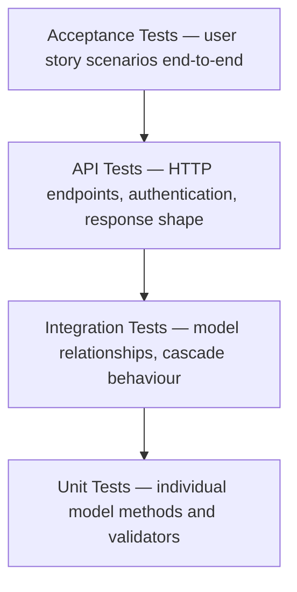

# Testing
{: .no_toc }

FeedMe uses a layered testing approach with **86 automated tests** — 69 backend (Django) and 17 frontend (Jest/React Testing Library) — covering unit, integration, API, acceptance, and component levels.

<details open markdown="block">
  <summary>Table of contents</summary>
  {: .text-delta }
- TOC
{:toc}
</details>

---

## Running the Tests

**Backend (Django):**
```bash
cd backend
source venv/bin/activate
python manage.py test app --verbosity=2
```
Expected output:
```
Ran 69 tests in 12.5s
OK
```

**Frontend (Jest + React Testing Library):**
```bash
cd frontend
npm test
```
Expected output:
```
Test Suites: 3 passed, 3 total
Tests:       17 passed, 17 total
Time:        ~0.5s
```

---

## Testing Strategy

FeedMe uses a **layered testing approach** covering three levels:



| Suite | Tests | Level | What is tested |
|-------|-------|-------|----------------|
| `UserAuthenticationTest` | 6 | Unit + Integration | Password hashing, login, wrong credentials, duplicates |
| `AddressModelTest` | 5 | Unit + Integration | Address creation, default-address logic, cascade delete |
| `RestaurantModelTest` | 6 | Unit | Create, rating validation (0–5), is_active flag |
| `MenuItemModelTest` | 6 | Unit + Integration | Price validation, availability flag, cascade delete |
| `OrderModelTest` | 9 | Unit + Integration | Subtotal, total, status transitions, price snapshot |
| `OrderItemModelTest` | 4 | Unit | Line total calculation, cascade delete |
| `AcceptanceTest` | 12 | Acceptance | User story scenarios US-01 through US-12 |
| `RestaurantAPITest` | 7 | API | List, filter, search, detail, inactive → 404 |
| `MenuItemAPITest` | 3 | API | Available items only, field shape, unknown restaurant |
| `OrderAPITest` | 6 | API | Auth required, isolation, create, subtotal/total in response |
| `AddressAPITest` | 5 | API | Auth required, isolation, create, delete |
| **Backend Total** | **69** | | |

### Frontend Test Suites (Jest + React Testing Library)

| Suite | Tests | What is tested |
|-------|-------|----------------|
| `CartContext.test.tsx` | 40+ | Cart state management — add, remove, update quantity, persist to localStorage, clear on checkout |
| `Navbar.test.tsx` | 6 | Component renders FeedMe brand, all navigation links present and point to correct routes |
| `api.test.ts` | 11 | API service layer — correct URLs constructed, responses parsed, ApiError thrown on failure |
| **Frontend Total** | **17** | |

| **Grand Total** | **86** | | |

### Test-Driven Development

Acceptance criteria were written in each user story `.md` file **before** implementation began. Tests were then derived directly from those criteria, following a lightweight TDD cycle:

1. Write acceptance criteria (user story file)
2. Write a failing test for that criterion
3. Implement the minimum code to make it pass
4. Refactor and confirm the test still passes

---

## Acceptance Tests (User Story Coverage)

Each acceptance test is named after the user story it validates:

| Test | User Story | What is verified |
|------|-----------|-----------------|
| `test_us01_user_can_register_account` | US-01 Create Account | Account created, password hashed, not staff |
| `test_us02_registered_user_can_login` | US-02 Login | Valid credentials succeed |
| `test_us02_wrong_credentials_cannot_login` | US-02 Login | Invalid credentials rejected |
| `test_us05_cart_total_calculated_correctly` | US-05 Shopping Cart | Subtotal and total with delivery fee |
| `test_us06_checkout_creates_confirmed_order` | US-06 Checkout | Order created with confirmed status and delivery address |
| `test_us07_order_status_progresses_to_delivered` | US-07 Track Order | Status transitions through full lifecycle |
| `test_us08_user_can_add_multiple_addresses` | US-08 Account Settings | Multiple addresses, single default enforced |
| `test_us09_default_address_updated_when_new_default_set` | US-09 Delivery Location | Setting new default clears old default |
| `test_us12_order_history_returns_all_user_orders` | US-12 Order History | All past orders returned for user |
| `test_price_snapshot_preserved_after_menu_change` | US-06 Checkout | Price locked at order time, unaffected by later menu changes |
| `test_inactive_restaurant_can_still_be_queried` | US-10 Select Restaurant | Inactive flag queryable for admin use |

---

## API Tests

The API test suite verifies that all REST endpoints behave correctly for authenticated and unauthenticated clients.

### Key security tests

| Test | Endpoint | Scenario | Expected |
|------|----------|----------|---------|
| `test_order_list_requires_authentication` | `GET /api/orders/` | No credentials | 403 Forbidden |
| `test_order_create_requires_authentication` | `POST /api/orders/create/` | No credentials | 403 Forbidden |
| `test_address_list_requires_authentication` | `GET /api/addresses/` | No credentials | 403 Forbidden |
| `test_user_cannot_see_other_users_orders` | `GET /api/orders/` | Authenticated as User A | Only User A's orders returned |
| `test_user_cannot_see_other_users_addresses` | `GET /api/addresses/` | Authenticated as User A | Only User A's addresses returned |

### Restaurant API tests

| Test | Scenario | Expected |
|------|----------|---------|
| `test_list_returns_only_active_restaurants` | Two active + one inactive restaurant | Inactive excluded from list |
| `test_filter_by_cuisine` | `?cuisine=japanese` | Only Japanese restaurants returned |
| `test_search_by_name` | `?search=burger` | Only matching restaurants returned |
| `test_detail_includes_menu_items` | `GET /api/restaurants/{id}/` | Response includes nested `menu_items` array |
| `test_detail_inactive_restaurant_returns_404` | Request inactive restaurant | 404 Not Found |

---

## API Endpoints

The REST API is served at `/api/` and provides the following endpoints:

| Method | Endpoint | Auth | Description |
|--------|----------|------|-------------|
| GET | `/api/restaurants/` | No | List active restaurants (supports `?search=` and `?cuisine=`) |
| GET | `/api/restaurants/{id}/` | No | Restaurant detail with full menu |
| GET | `/api/restaurants/{id}/menu/` | No | Available menu items for a restaurant |
| GET | `/api/orders/` | Yes | List current user's order history |
| POST | `/api/orders/create/` | Yes | Place a new order |
| GET | `/api/orders/{id}/` | Yes | Order detail with items, subtotal, total |
| GET | `/api/addresses/` | Yes | List current user's saved addresses |
| POST | `/api/addresses/` | Yes | Add a new address |
| PUT/PATCH | `/api/addresses/{id}/` | Yes | Update an address |
| DELETE | `/api/addresses/{id}/` | Yes | Delete an address |

---

## Test Isolation

Every test runs in a **database transaction that is rolled back** after the test completes. This means:
- Tests are fully independent — no shared state between tests
- Test order does not affect results
- The production database is never touched during testing

Django's `TestCase` class handles this automatically.

---

## Test Data Helpers

To avoid repetition, shared helper functions are defined at the top of `tests.py`:

```python
make_user(username, password)      # Creates a Django User
make_restaurant(name, cuisine)     # Creates a Restaurant
make_menu_item(restaurant, ...)    # Creates a MenuItem
make_address(user, street, ...)    # Creates an Address
```

These helpers keep individual tests concise and focused on what is being asserted, not on setup boilerplate.
