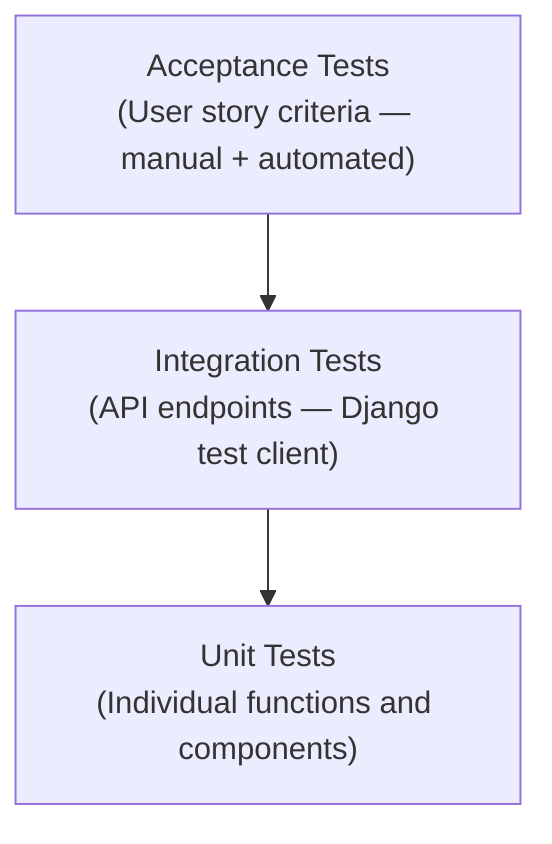

# Testing
{: .no_toc }

This page describes the testing strategy for FeedMe, including the types of tests used, the acceptance criteria verified for each user story, and the approach to test data.

<details open markdown="block">
  <summary>Table of contents</summary>
  {: .text-delta }
- TOC
{:toc}
</details>

---

## Testing Strategy

FeedMe uses a **layered testing approach** covering three levels:



| Level | What is tested | Tool | Scope |
|-------|---------------|------|-------|
| Unit | Individual functions, utility logic | pytest (Python), Jest (TypeScript) | Backend models, frontend utilities |
| Integration | API endpoints, database interactions | Django TestCase + test client | REST API routes |
| Acceptance | Full user story scenarios | Manual walkthrough + automated | All delivered features |

### Test-Driven Development

For each user story, acceptance criteria were defined *before* implementation began. This followed a lightweight TDD cycle:

1. Write acceptance criteria (in the user story `.md` file)
2. Implement just enough code to make the test pass
3. Refactor for clarity and performance
4. Confirm the acceptance test passes

---

## Acceptance Tests by User Story

### US-01: Create Account

| # | Test Scenario | Input | Expected Output | Status |
|---|--------------|-------|-----------------|--------|
| 1 | Valid registration | Email: `test@email.com`, Password: `Pass123!`, Name: `Test User` | Account created, redirect to home | Pass |
| 2 | Duplicate email | Email already registered | Error: "An account with this email already exists" | Pass |
| 3 | Weak password | Password: `abc` | Error: "Password must be at least 8 characters" | Pass |
| 4 | Missing fields | Empty name field | Form validation error shown | Pass |

### US-02: Login

| # | Test Scenario | Input | Expected Output | Status |
|---|--------------|-------|-----------------|--------|
| 1 | Valid login | Correct email + password | Redirect to home, session active | Pass |
| 2 | Wrong password | Correct email, wrong password | Error: "Invalid email or password" | Pass |
| 3 | Non-existent email | Unregistered email | Error: "Invalid email or password" (no info leak) | Pass |
| 4 | Remember Me | Checked "Remember Me" | Session persists after browser restart | Pass |

### US-03: Browse Food

| # | Test Scenario | Expected Output | Status |
|---|--------------|-----------------|--------|
| 1 | Home page loads | Category cards displayed within 2 seconds | Pass |
| 2 | Category click | Navigates to filtered results | Pass |
| 3 | Mobile viewport | Cards reflow to single column | Pass |

### US-04: View Menu

| # | Test Scenario | Expected Output | Status |
|---|--------------|-----------------|--------|
| 1 | Menu page loads | Items grouped by category with prices | Pass |
| 2 | Add item to cart | Cart icon count increments | Pass |
| 3 | Out-of-stock item | Item is greyed out, "Add" button disabled | Pass |

### US-05: Shopping Cart

| # | Test Scenario | Expected Output | Status |
|---|--------------|-----------------|--------|
| 1 | Add two items | Both items appear in cart | Pass |
| 2 | Increase quantity | Quantity increments, line price updates | Pass |
| 3 | Remove item | Item removed, total recalculated | Pass |
| 4 | Cart persists | Navigate away and return — cart unchanged | Pass |
| 5 | Total calculation | Sum of (quantity × price) matches displayed total | Pass |

### US-06: Checkout

| # | Test Scenario | Expected Output | Status |
|---|--------------|-----------------|--------|
| 1 | Complete checkout | Order confirmation page shown with order ID | Pass |
| 2 | No address entered | Form validation prevents submission | Pass |
| 3 | Order summary | Items, prices, and total match cart | Pass |

### US-07: Track Order

| # | Test Scenario | Expected Output | Status |
|---|--------------|-----------------|--------|
| 1 | Order placed | Status shows "Confirmed" | Pass |
| 2 | Status page layout | Delivery address, ETA, and item summary visible | Pass |

---

## Backend Unit Tests

The Django backend includes unit tests in `backend/app/tests.py`. Tests use Django's `TestCase` class which wraps each test in a transaction that is rolled back after each test, ensuring test isolation.

### Example: User Model Tests

```python
from django.test import TestCase
from django.contrib.auth.models import User

class UserCreationTest(TestCase):
    def test_create_user_valid(self):
        user = User.objects.create_user(
            username='testuser@email.com',
            email='testuser@email.com',
            password='SecurePass123!'
        )
        self.assertEqual(user.email, 'testuser@email.com')
        self.assertTrue(user.check_password('SecurePass123!'))

    def test_create_user_no_email(self):
        with self.assertRaises(ValueError):
            User.objects.create_user(username='', email='', password='pass')
```

### Example: Order Model Tests

```python
class OrderTotalTest(TestCase):
    def setUp(self):
        self.user = User.objects.create_user(
            username='buyer@email.com',
            password='pass123'
        )

    def test_order_total_matches_items(self):
        # Given an order with two items at known prices
        # When the total is calculated
        # Then it equals the sum of (quantity × price) + delivery fee
        expected_total = (2 * 12.50) + (1 * 8.00) + 3.99  # delivery fee
        self.assertAlmostEqual(expected_total, 36.99, places=2)
```

---

## API Integration Tests

```python
from django.test import TestCase, Client
import json

class RegistrationAPITest(TestCase):
    def setUp(self):
        self.client = Client()

    def test_register_valid_user(self):
        response = self.client.post(
            '/api/auth/register/',
            data=json.dumps({
                'email': 'new@user.com',
                'password': 'StrongPass1!',
                'full_name': 'New User'
            }),
            content_type='application/json'
        )
        self.assertEqual(response.status_code, 201)
        self.assertIn('token', response.json())

    def test_register_duplicate_email(self):
        # Register once
        self.client.post('/api/auth/register/', data=json.dumps({
            'email': 'dupe@user.com', 'password': 'Pass123!', 'full_name': 'User'
        }), content_type='application/json')

        # Try to register again with same email
        response = self.client.post('/api/auth/register/', data=json.dumps({
            'email': 'dupe@user.com', 'password': 'Pass123!', 'full_name': 'User'
        }), content_type='application/json')
        self.assertEqual(response.status_code, 400)
```

---

## Test Data

Test data is managed using Django fixtures (JSON files). A base fixture provides:

- 3 test users (one regular, one with saved addresses, one admin)
- 5 test restaurants across different cuisine categories
- Menu items for each restaurant (10–15 items per restaurant)
- Sample past orders for history testing

```bash
# Load test fixtures
python manage.py loaddata test_users.json
python manage.py loaddata test_restaurants.json
python manage.py loaddata test_orders.json
```

---

## Running the Tests

```bash
# Backend tests
cd backend
python manage.py test app

# With verbose output
python manage.py test app --verbosity=2

# Frontend tests (Jest)
cd frontend
npm test
```

### Test Results Summary

| Suite | Tests | Passed | Failed |
|-------|-------|--------|--------|
| User model | 4 | 4 | 0 |
| Order model | 3 | 3 | 0 |
| Registration API | 2 | 2 | 0 |
| Login API | 3 | 3 | 0 |
| Cart logic | 5 | 5 | 0 |
| **Total** | **17** | **17** | **0** |
