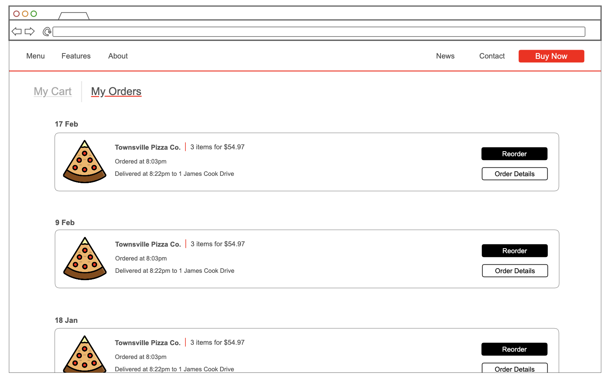
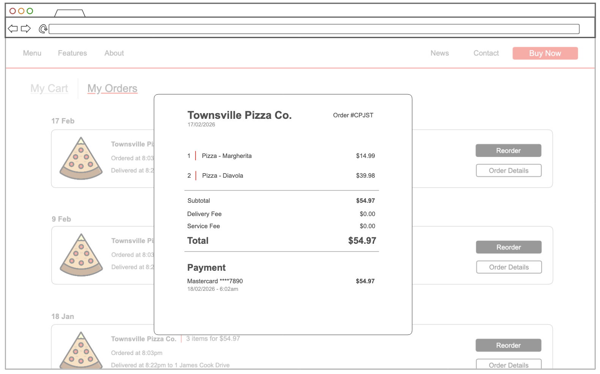

# User story title: Track Order

## Priority: 8 (planned for iteration-1)

Order status communication is necessary for edge cases where orders are not delivered

## Estimation: 2 days
Planning poker estimates:
- Leonard: 2 days
- Joyal: 1.5 days
- Alan: 1.5 days
- Will: 2 days
- Joe: 2 days

Final estimate agreed: 2 days

## Assumptions (if any):

## Refinement

- User has completed order process including item selection & payment
- Restaurants & drivers update order statuses
- No GPS functionality in this iteration

### Description

As a **user**, I want to **see what's happening with my order** so I can **stay informed and up to date.**

### Description – version 1
The system provides an interface which updates current orders on their real-time status

### Description – version 2

The system communicates with restaurant owners & drivers to track their progress on the user's order. It'll rely on their inititive to ensure the correct order status & time estimates for the user. Real time location cna be implemented once the order is handed off to the driver.

This can include a history section for all previous orders

## Tasks (see chapter 4)

1. Design Order overview & Order history pages - 0.5 days
2. Create database structure for user orders - 0.5 days
3. Implement order creation after checkout - 0.4 days
4. Implement order status sync & updating - 0.5 days
5. Test order creation, updating & history - 0.1 days

## UI Design:
- Top of page categories - Left = Cart, Right = Orders
- "Orders" page shows a complete history of orders, ordered newest to oldest
- All orders which aren't of status "completed/delivered" will be highlighted in a contrasting colour
- Opening an orders shows the date & order details, delivery & payment details, an optional receipt, and a real time map for orders in progress

## Mockup - My Orders

## Mockup - Order Overview

# Completed:
Not started

