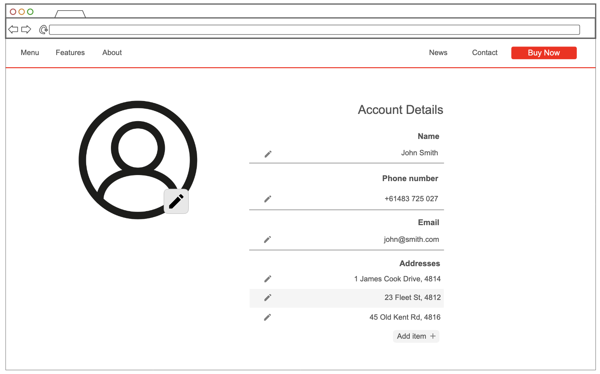

# User story title: Account Settings

## Priority: 6 (planned for iteration-1)

Editable account details are important for situations where communication or physical addresses change, or if login information should be altered

## Estimation: 2 days
Planning poker estimates:
- Leonard: 1.5 days
- Joyal: 1.5 days
- Alan: 2 days
- Will: 1.5 days
- Joe: 1.5 days

Final estimate agreed: 1.5 days

## Assumptions (if any):

## Precondition

- User has already created an account

### Description

As a **user**, I want to **update addresses, phone numbers & passwords** if or when they change

### Description – version 1
The system provides an interface which allows personal details to be updated to their desired value

### Description – version 2

The system provides a view for editing information provided by the user, such as emails, phone numbers, addresses, payment info & passwords. 

These will be freely editable within the interface and will only save & writeback to the database upon the user actioning the save.

## Tasks (see chapter 4)

1. Design Account settings page - 0.5 days
2. Create database structure for user details - 0.5 days
3. Implement data writeback & new password authentication - 0.3 days
4. Test editing account details - 0.2 days

## UI Design:
- Left side of page shows profile picture with large preview, right side of screen shows profile information
- Information is seperated into sections and clearly labeled, and entire row is clickable for editing purposes
- Addresses are in a list, with alternative background shades to easily depict items.
- Additional addresses can be added using the add button in the same section

## Mockup - Account Settings

# Completed:
Not started

