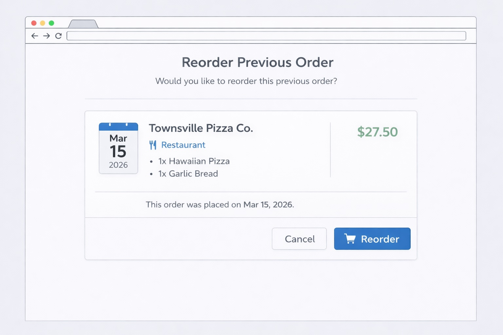

# User story title: Reorder previous order

## Priority: 5 (planned for iteration-2)

Reordering previous orders allows users to quickly order the same meals again.

## Estimation: 2 days
Planning poker estimates:
- Leonard: 2 days
- Joyal: 1.5 days
- Alan: 2 days
- Will: 2 days
- Joe: 1.5 days

Final estimate agreed: 2 days

## Assumptions (if any)

## Precondition

- The user is logged in.
- The user has previously placed at least one order.
- Previous order data is stored in the database.
- Reordering adds the same items from the previous order to the shopping cart.

## Description
As a **user**, I want to **reorder a previous order** so that **I can quickly place the same order again**.

### Description – version 1
The system displays a "Reorder" button next to previous orders in the order history.

### Description – version 2
When the user clicks the "Reorder" button, the same items from the previous order are added to the shopping cart.

## Tasks (see chapter 4)
1. Add reorder button to order history UI – 0.5 days  
2. Retrieve items from previous order – 0.5 days  
3. Add items to shopping cart automatically – 0.5 days  
4. Test reorder functionality – 0.5 days  

## UI Design
- "Reorder" button displayed on each order card in the order history
- Clicking the button adds items directly to the shopping cart
- If the order succesffuly went through or if an error occured, it is visually
shown through a small pop up container/card with information text 

### Mockup

## Completed
- Feature implemented in iteration 2
- Reorder button available on each order card in the order history page (`/orders`)
- Clicking the button re-adds all items from the previous order to the shopping cart
- Visual feedback (success/error notification) displayed after reorder action
- Acceptance criteria met:
  - [x] Each order card displays a "Reorder" button
  - [x] Clicking reorder adds previous items to the cart
  - [x] User receives visual confirmation that the reorder was successful
- Deployed at: https://feedme-dusky.vercel.app/orders