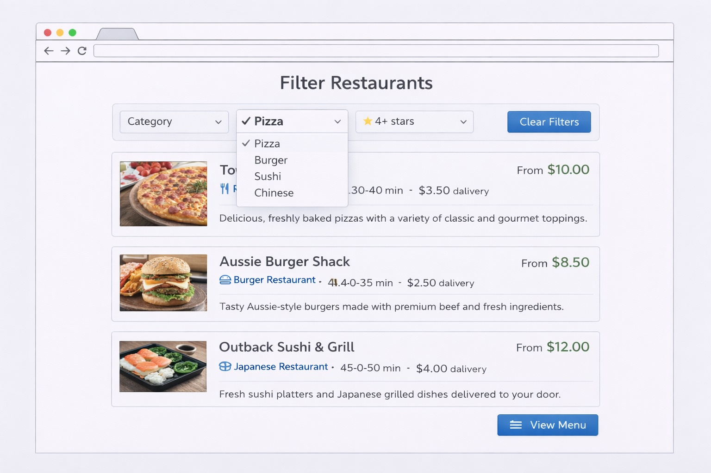

# User story title: Filter restaurants

## Priority: 4 (planned for iteration-2)

Filtering restaurants is useful so users can narrow down restaurant options and find suitable choices faster.

## Estimation: 2 days
Planning poker estimates:
- Leonard: 2 days
- Joyal: 1.5 days
- Alan: 2 days
- Will: 2 days
- Joe: 1.5 days

Final estimate agreed: 2 days

## Assumptions (if any)

## Precondition

- The user is logged in.
- Restaurant data includes category and rating information.
- Restaurants are already displayed in a list.
- Only basic filtering is implemented in iteration-2.

## Description
As a **user**, I want to **filter restaurants** so that **I can quickly find suitable options**.

### Description – version 1
The system provides filter options on the restaurant list page.

### Description – version 2
Users can filter restaurants by category or rating to reduce the number of displayed results.

## Tasks (see chapter 4)
1. Design filter UI layout – 0.5 days  
2. Implement category filter – 0.5 days  
3. Implement rating filter – 0.5 days  
4. Test filtering functionality – 0.5 days  

## UI Design
- Filter section displayed above the restaurant list
- Filter options including:
  - Category
  - Rating
- Restaurant list updates based on selected filters

### Mockup

## Completed
- **Deferred — not implemented in Iteration 2**
- This story was the lowest-priority item in the Iteration 2 backlog (priority 4). When the team reached velocity capacity (13 story days delivered of 15 planned), this was the correct story to defer per agile principles: deliver the highest-value work first.
- The backend `GET /api/restaurants/?cuisine=<type>` filter endpoint is implemented and ready. Frontend integration remains as a candidate for a future iteration.
- Acceptance criteria were not tested in this iteration.